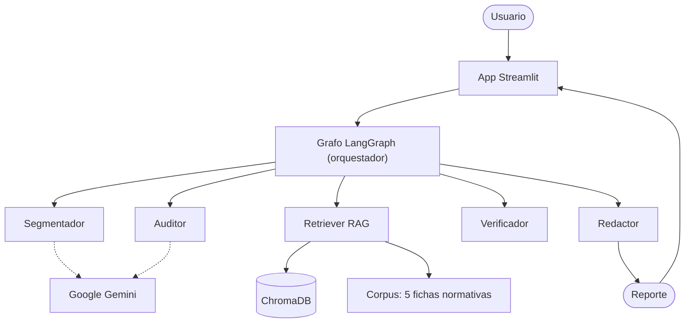
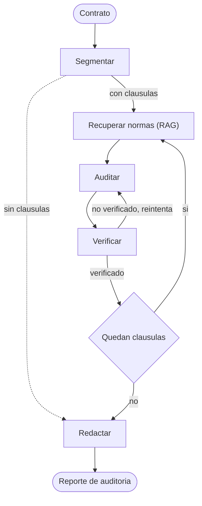

# LexAudit

**Auditor preliminar multiagente de riesgos en contratos laborales colombianos.**

LexAudit recibe un contrato laboral y produce un **reporte de auditoría
preliminar**: hallazgos priorizados por severidad, cada uno con cita a la norma
aplicable, una recomendación de corrección y un score de cumplimiento (0-100).

> ⚠️ **Aviso:** Este sistema no reemplaza asesoría legal profesional. Genera una
> revisión preliminar basada en un corpus normativo curado.

---

## Qué hace

Un sistema multiagente, orquestado con **LangGraph**, que audita un contrato
contra 5 riesgos laborales frecuentes y verificables:

1. Salario mínimo
2. Jornada laboral
3. Período de prueba
4. Prestaciones sociales
5. Cláusulas nulas / irrenunciabilidad de derechos

El sistema **no responde preguntas** — produce un entregable: un reporte.

## Arquitectura

### Componentes



### Orquestación (el grafo)

El contrato se procesa cláusula por cláusula. El grafo tiene un **loop de
verificación** (reaudita si el hallazgo no se verifica, hasta 2 veces) y una
**iteración** que recorre todas las cláusulas:



### Los 5 agentes

| Agente | Rol |
|--------|-----|
| Segmentador | Parte el contrato en cláusulas y detecta cláusulas obligatorias ausentes |
| Retriever | Recupera del corpus las normas aplicables a cada cláusula (RAG híbrido) |
| Auditor | Dictamina cada cláusula: cumple / viola / ambigua / faltante |
| Verificador | Comprueba que cada dictamen cite una norma real (anti-alucinación) |
| Redactor | Consolida el reporte con hallazgos, recomendaciones y score |

El detalle de diseño está en [`docs/`](docs/).

## Stack

Python 3.12 · LangGraph · LangChain · Google Gemini · ChromaDB · Streamlit

## Instalación

Requiere [uv](https://docs.astral.sh/uv/).

```bash
git clone https://github.com/LadyGonzalezP/lexaudit.git
cd lexaudit
uv sync
```

Configurá la clave de API:

```bash
cp .env.example .env
# editá .env y poné tu GEMINI_API_KEY (gratis en https://aistudio.google.com/apikey)
```

## Uso

```bash
# 1. Indexar el corpus normativo (una sola vez)
uv run python -m lexaudit.rag.ingest

# 2. Levantar la demo
uv run streamlit run app.py
```

## Tests

```bash
uv run pytest
```

La suite cubre la lógica **determinista** (verificación de citas, cálculo del
score, decisiones del grafo). Los componentes que dependen del LLM —que no son
deterministas— se validan con corridas de integración end-to-end.

## Documentación

- [`docs/decisions.md`](docs/decisions.md) — decisiones de diseño y trade-offs
- [`docs/ai-usage.md`](docs/ai-usage.md) — uso de IA en la construcción
- [`docs/spec-lexaudit.md`](docs/spec-lexaudit.md) — especificación funcional

## Licencia

Proyecto desarrollado como reto técnico. Uso educativo.
